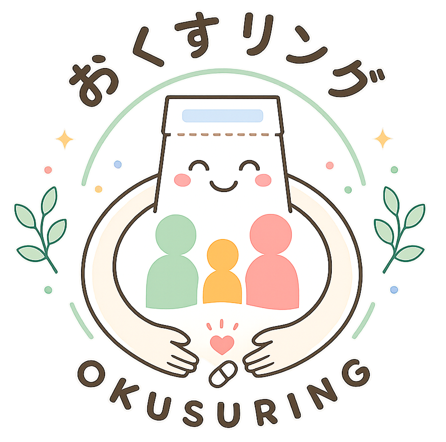
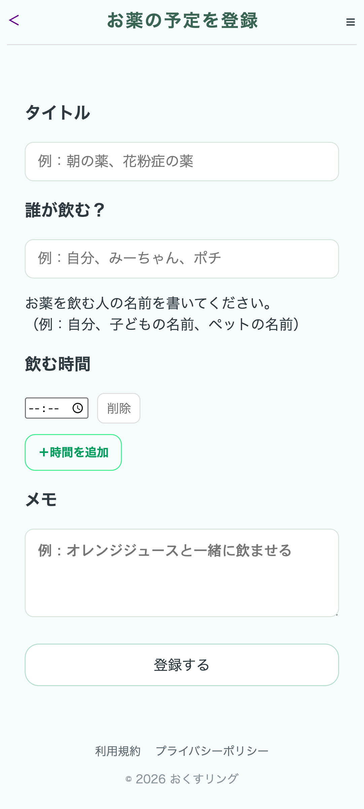
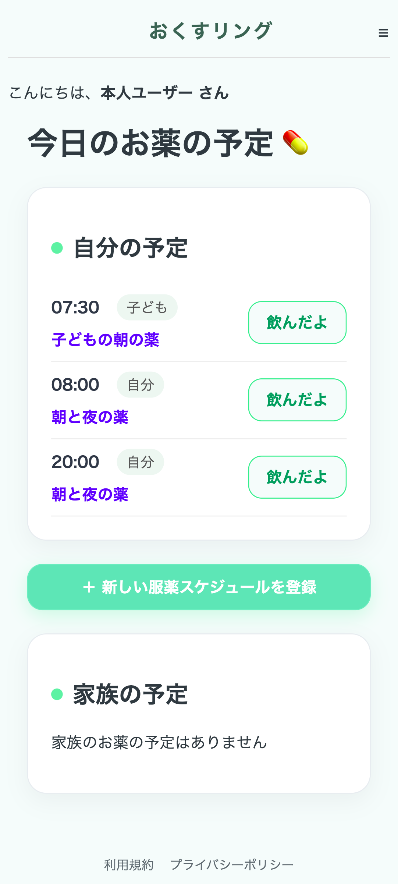
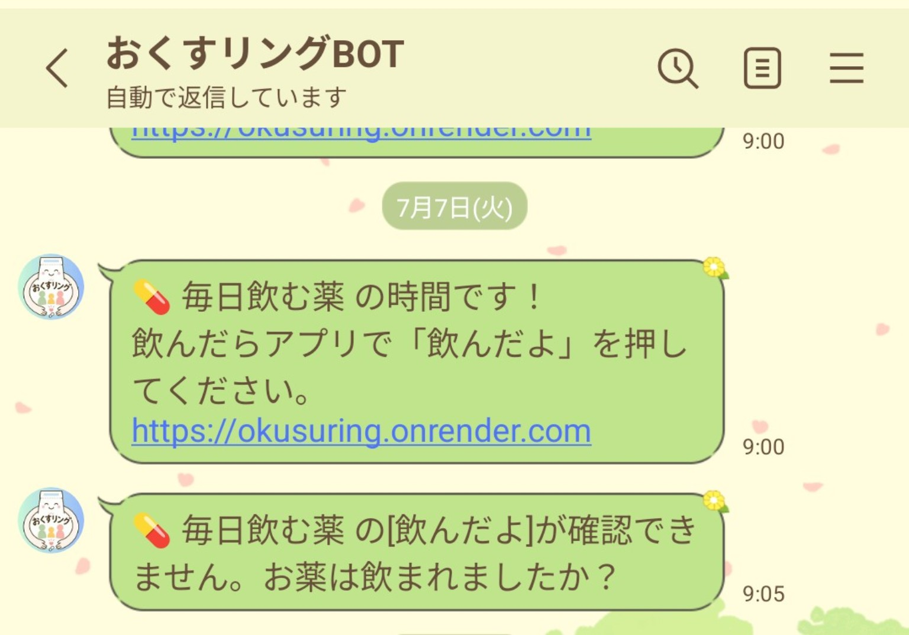
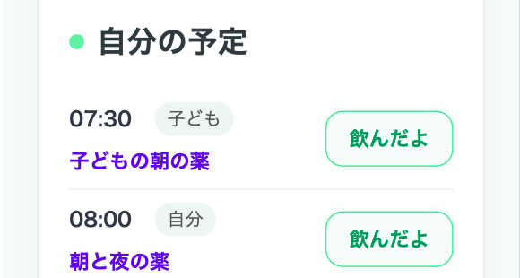
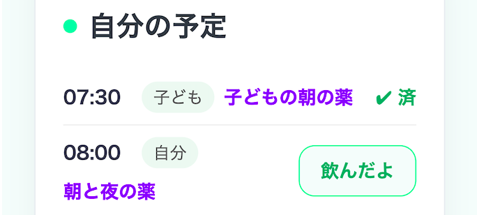
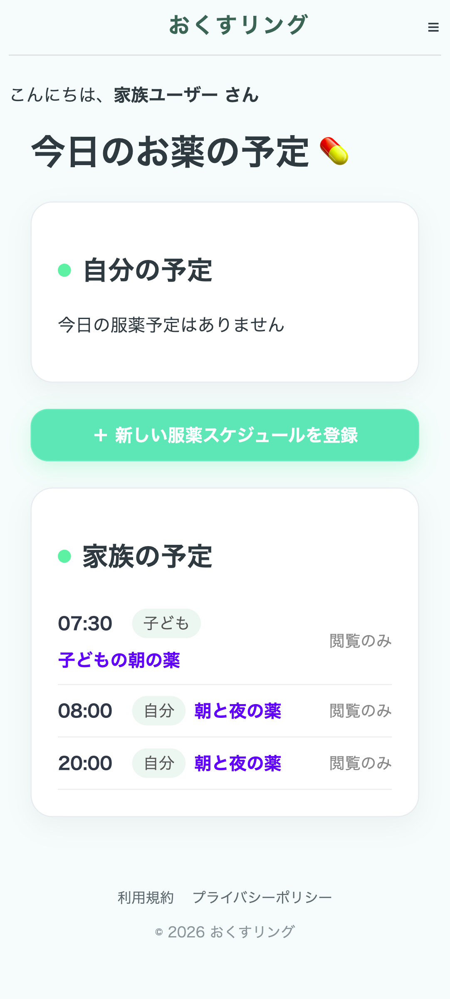
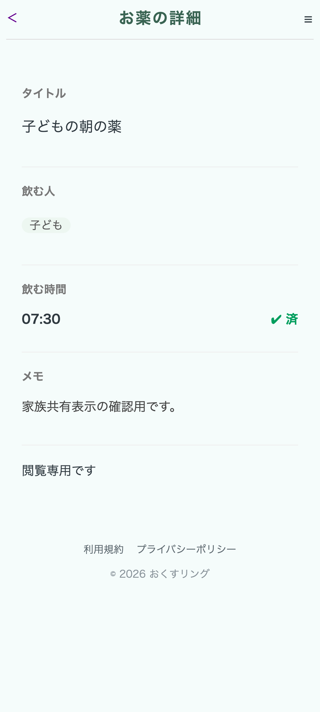

# おくすリング


おくすリングは、自分や家族の服薬の飲み忘れを防ぐことに特化した、シンプルなリマインダーサービスです。

服薬時間になるとLINEで通知が届き、ワンタップで「飲んだよ」を記録できます。
家族共有を使うことで、家族の服薬予定や服薬状況も確認できます。

「お薬情報の詳細管理」や「診療予約」などの機能はあえて省き、飲み忘れ防止に必要な機能だけに絞っています。

## URL

[おくすリング](https://okusuring.onrender.com)

## 使い方

### 1. 服薬スケジュールを登録

服用するお薬と服薬時間を登録します。




左：服薬スケジュール登録画面 ／ 右：登録後の服薬予定画面

### 2. 服薬時間にLINEで通知

登録した時間になると、LINEで服薬のお知らせが届きます。



### 3. 「飲んだよ」を記録

服薬後に「飲んだよ」を押すことで、その日の服薬を記録できます。




左：服薬前 ／ 右：「飲んだよ」記録後

### 4. 家族と服薬予定を共有

家族共有を利用すると、家族の服薬予定を閲覧できます。

予定の詳細画面では、服薬済みかどうかも確認できます。




左：家族の服薬予定一覧 ／ 右：服薬状況を確認できる詳細画面

## 主な機能

- 服薬スケジュールの登録・編集・削除
- 服薬時間にLINEで通知
- 「飲んだよ」による服薬記録
- 服薬が記録されていない場合の再通知
- 家族との服薬スケジュール共有
- 家族の服薬予定・服薬状況の確認

## 動作環境

- Ruby 3.2.2
- Ruby on Rails 7.1.6
- SQLite3（開発・テスト環境）
- PostgreSQL（本番環境）

## セットアップ

リポジトリをクローンします。

```bash
git clone https://github.com/sharoa119/okusuring.git
cd okusuring
```

セットアップを実行します。

```bash
bin/setup
```

アプリケーションを起動します。

```bash
bin/rails server
```

ローカル環境での確認方法は、以下を参照してください。

## ローカル環境での確認方法

ローカル環境では、LINEログインを行わずに開発用ユーザーでログインできます。

以下のURLにアクセスしてください。

```text
http://localhost:3000/dev/session/new
```

確認したいユーザーを選択すると、それぞれの状態で画面を確認できます。

* 本人ユーザー：服薬予定の登録・編集・削除、服薬記録を確認できます
* 家族ユーザー：共有された家族の服薬予定・服薬状況を確認できます
* 予定なしユーザー：服薬予定が登録されていない場合の表示を確認できます
* BOT未連携ユーザー：LINE BOT未連携時の表示を確認できます

### 家族招待画面の確認方法

家族招待フローの確認用データを用意しています。

#### 未ログイン時の招待画面

ログアウトした状態で以下のURLにアクセスしてください。

（ログアウトはハンバーガーメニュー内の「ログアウト」から行えます。）

```text
http://localhost:3000/invite/dev_pending_invite_token
```

LINEログインを案内する招待画面を確認できます。

#### LINE BOT未連携時の招待画面

開発用ログイン画面から「BOT未連携ユーザー」としてログインし、以下のURLにアクセスしてください。

```text
http://localhost:3000/invite/dev_pending_invite_token
```

LINE公式アカウントの友だち追加を案内する画面を確認できます。

#### 家族共有完了画面

開発用ログイン画面から「家族ユーザー」としてログインし、以下のURLにアクセスしてください。

```text
http://localhost:3000/invite/dev_pending_invite_token
```

家族共有の完了画面を確認できます。

招待完了後に再度招待フローを確認する場合は、以下を実行してください。

```bash
bin/rails db:seed
```

確認用の招待データが招待前の状態に戻ります。
